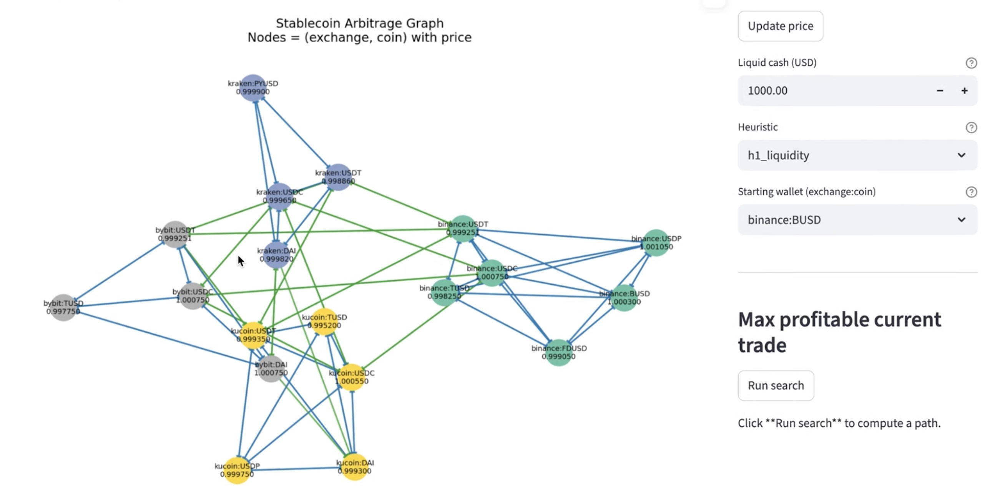
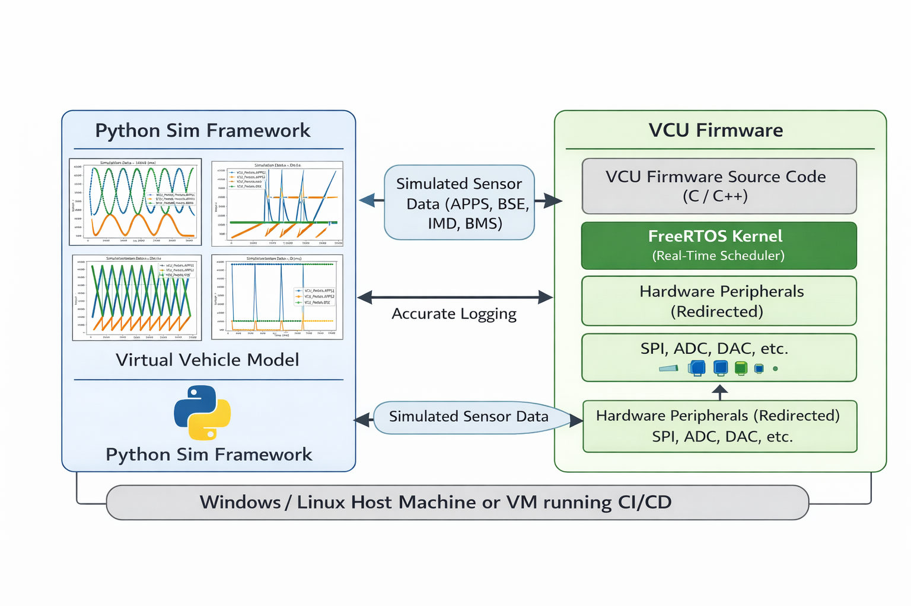
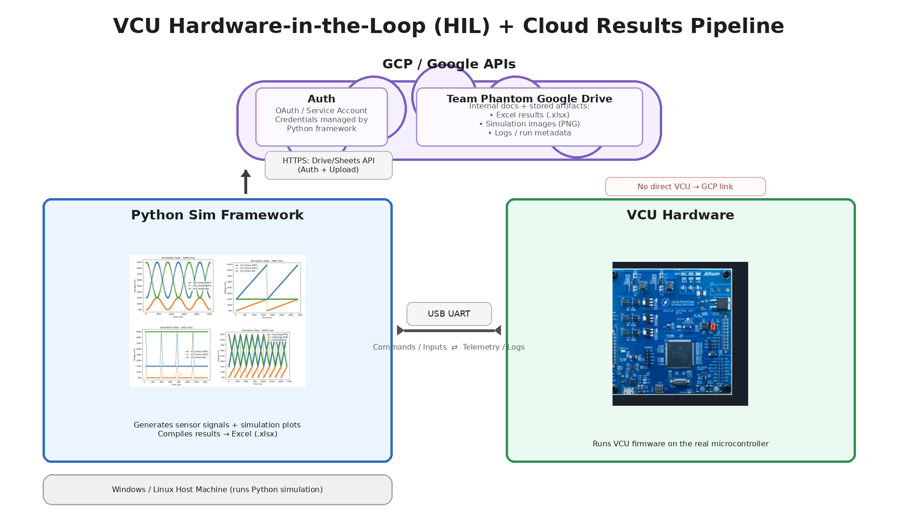
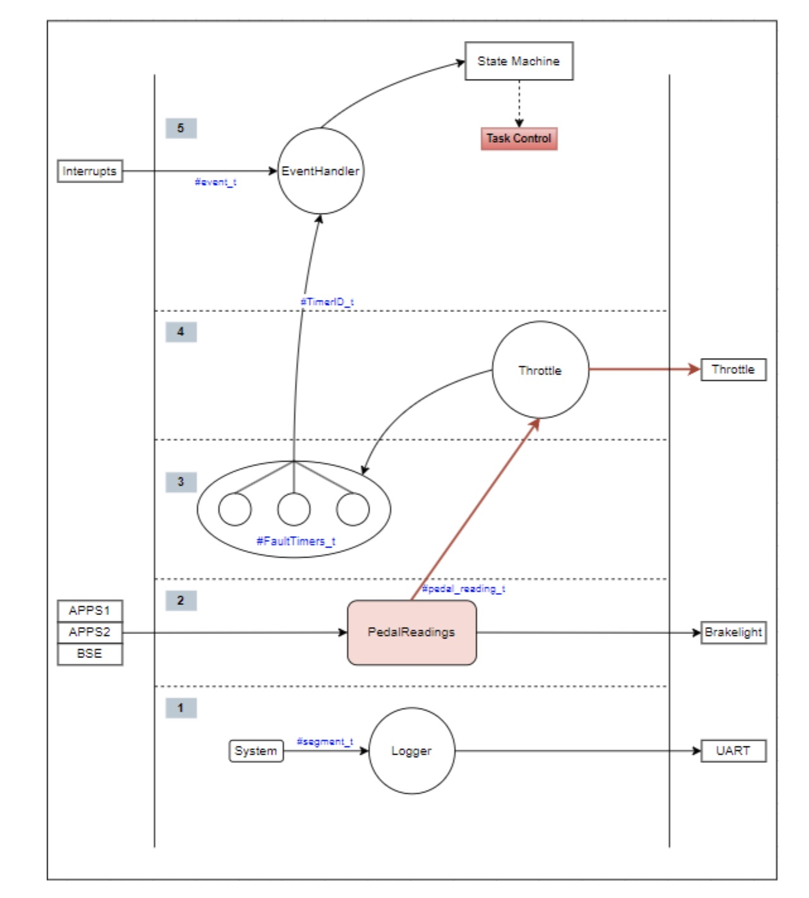

<h1 align="center">
  
</h1>

<h2 align="center">👨‍💻 Top Repositories 👨‍💻</h2> 

 

### 🔄 Stablecoin Cross-Exchange Arbitrage

  

### ⚙️ VCU SIL Framework Setup

  

### 🧪 Testing Framework

  

### ⚡ VCU Framework (vcu-fw)

 

   

  

<h4 align="center"> 

  <a href="https://github.com/kevinl03?tab=repositories" title="Show Repositories">🔎 Show More 🔍</a> 

</h4> 

 Refer to pinned repos below 

 
 <h2 align="center">⚡  Stats  ⚡</h2>
 

  <!-- Stats using Shields.io - Very Reliable -->
  
  
    
  
  

<h2 align="center">💻 Media 💻</h2>

  
  &nbsp;
  
  &nbsp;
   

